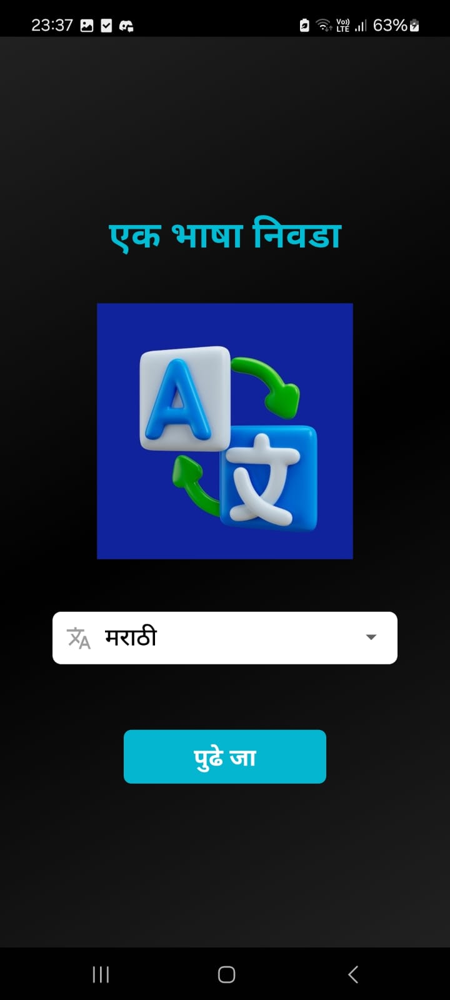
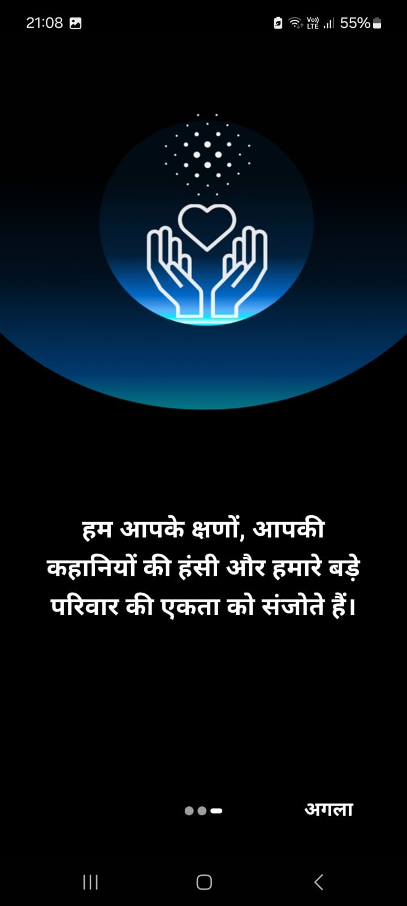
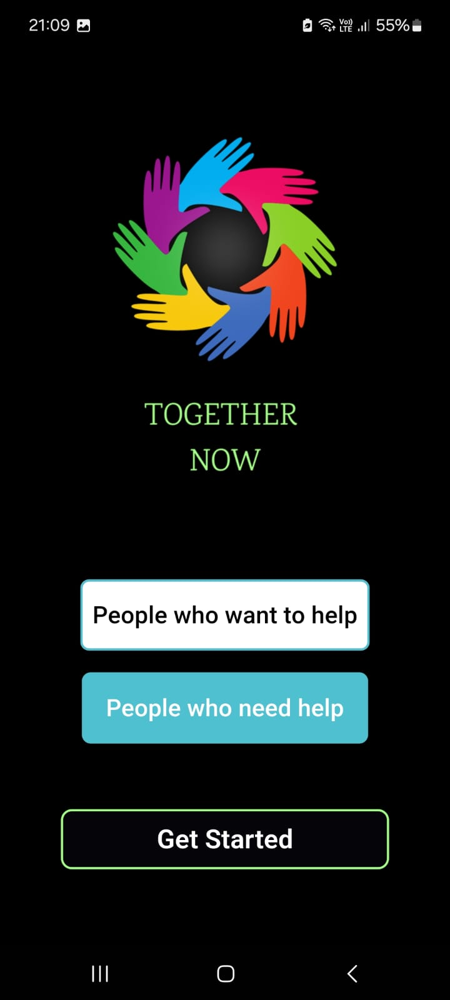
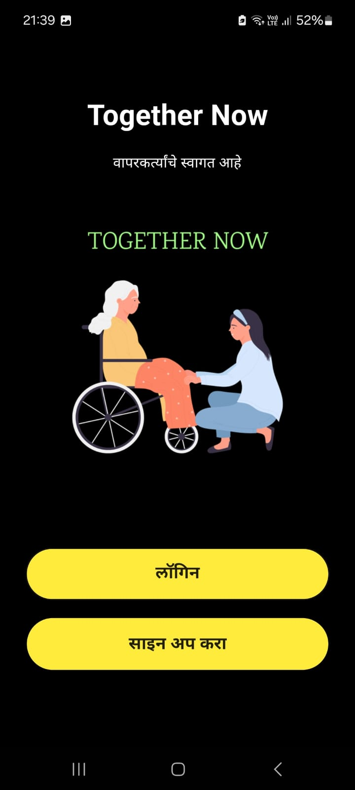
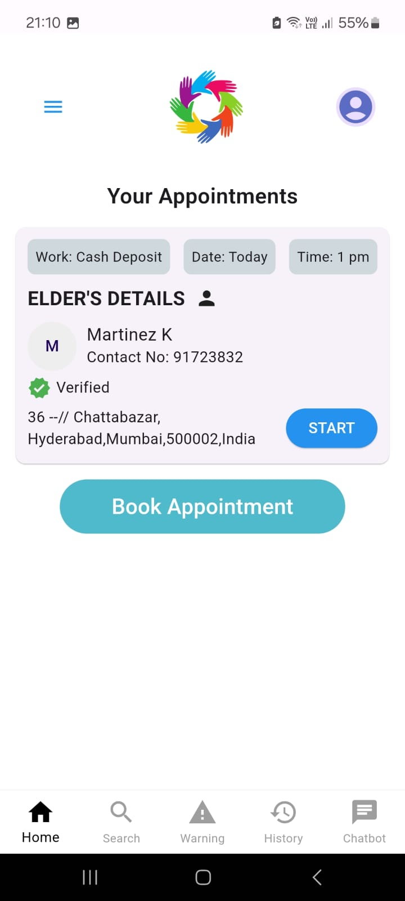
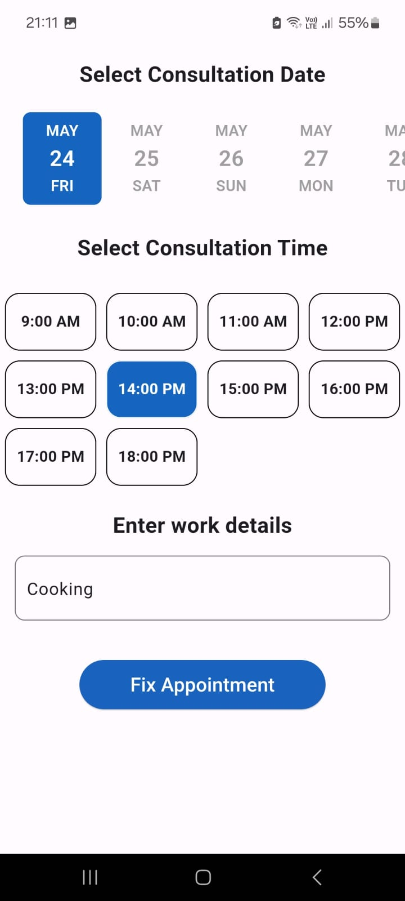
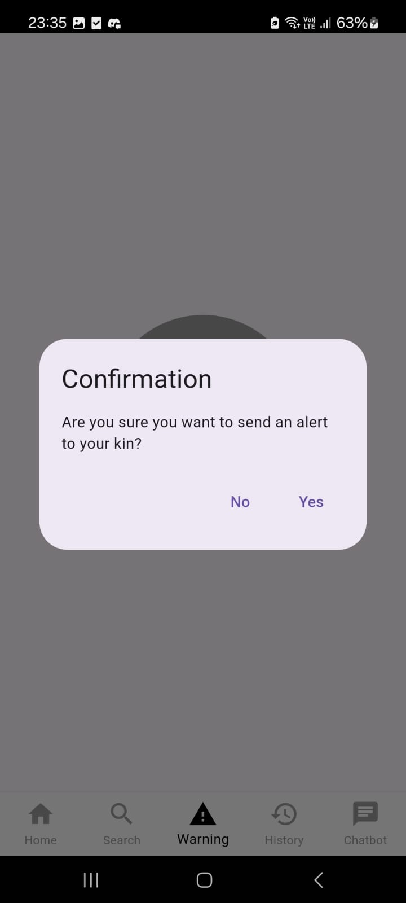
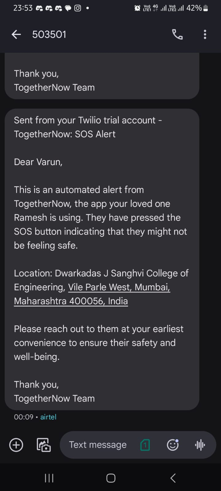
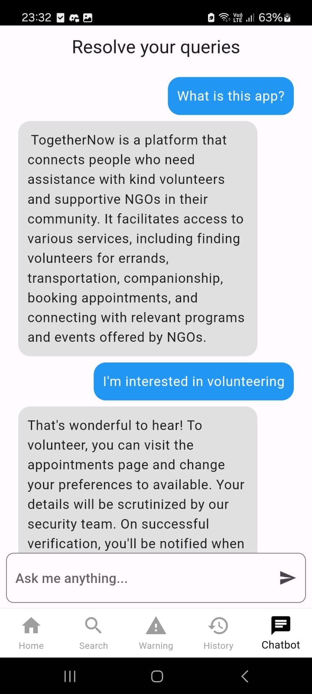
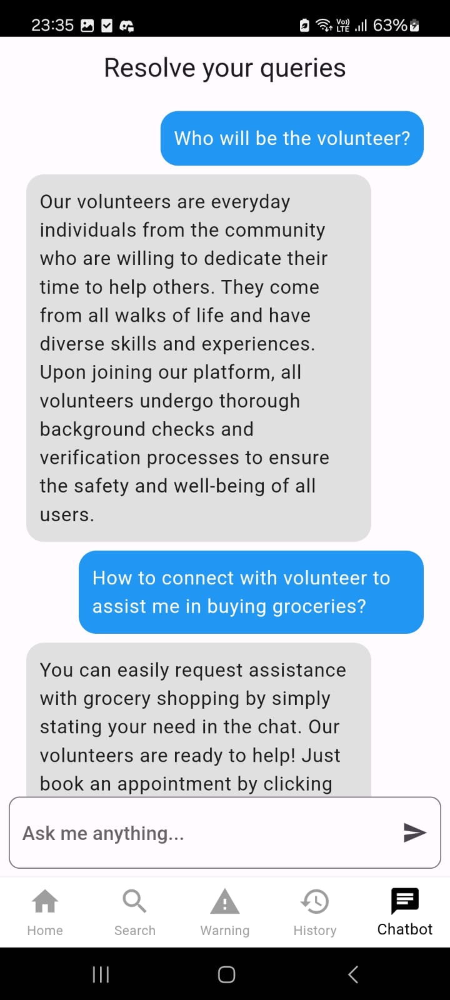

# Together Now

The application aims to address the challenges faced by the elderly population by connecting them with willing volunteers through a secure and technologically advanced platform. It verifies volunteers' identities, employs GPS tracking for safety, and utilizes AI to match volunteers with tasks based on their skills and the needs of the elderly. A real-time review system fosters accountability and trust. Ultimately, the goal is to combat elderly isolation and help them while fostering a sense of community and support between generations.

## Features

- Cross platform app available for both Android and iOS
- Multingual Support for all user groups
- Firebase authentication for login
- A personalized chatbot for answering all your queries regarding  our application
- SOS functionality to send SMS to kin of person in case of any emergencies
- Facility to book an appointment for a task

## Screenshots
### App

**The app is available for both iOS and Android.**

  
  

  
  

  
  

  
  

  
  

  

